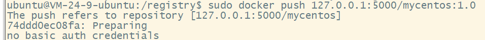

### 2024-11-07

- 完成linux registry 容器服务搭建
环境要求:
- 操作系统: Linux ubuntu 22.04
- 本地public ip: 81.71.95.219
- 本地docker已安装

···
- 本地跑通容器服务

1. 使用docker registry 镜像创建容器服务
docker run -d -p 5000:5000 -v /registry:/var/lib/registry --restart=always --name my-registry registry

2. 拉取nginx镜像
docker pull nginx # 作为测试镜像

3. 打包自己的镜像
docker tag nginx 127.0.0.1:5000/my-nginx:1.0 # 127.0.0.1:5000 为本地registry地址 my-nginx为镜像名称 1.0为版本号

4. 推送镜像
docker push 127.0.0.1:5000/my-nginx:1.0

5. 测试服务
docker rmi nginx # 删除本地nginx镜像
docker pull 127.0.0.1:5000/my-nginx:1.0 # 从本地registry拉取镜像
docker run -d -p 80:80 --name my-nginx 127.0.0.1:5000/my-nginx:1.0 # 启动容器

此处完成本地镜像服务搭建
···

···
- 容器服务开放
- 环境要求:
- 操作系统: Linux ubuntu 22.04
- 本地public ip: 81.71.95.219
- 本地docker已安装
- 端口开放 5000

1. 使用docker registry 镜像创建容器服务(同上 需要删除刚刚本地测试的registry)
sudo docker run -d -p 5000:5000 -v /registry:/var/lib/registry --restart=always --name my-registry registry

2. 拉取nginx镜像
sudo docker pull nginx

3. 推送镜像
sudo docker push 127.0.0.1:5000/my-nginx:1.0 # 若容器服务器地址在本地即可用本地地址127.0.0.1:5000 若为远程服务器则可以使用 81.71.95.219:5000

4. 测试服务
远程测试地址: curl http://81.71.95.219:5000/v2/_catalog 结果为{"repositories":["my-nginx"]} 则表示成功
远程拉取可以配置docker的daemon.json文件 镜像源为 81.71.95.219:5000
配置路径为 /etc/docker/daemon.json
添加以下内容
{
    "registry-mirrors":[
        ""
    ],
    "insecure-registries":[
        "81.71.95.219:5000" # 远程registry地址
    ]
}

sudo docker rmi nginx # 删除本地nginx镜像
sudo docker pull 81.71.95.219:5000/my-nginx:1.0 # 从远程registry拉取镜像
sudo docker run -d -p 80:80 --name my-nginx 81.71.95.219:5000/my-nginx:1.0 # 启动容器

5.若需要使用域名则需要申请证书与配置nginx 由于registry服务为https 则需要使用https
申请证书与域名后 配置nginx 配置文件为 在 /etc/nginx/ssl # 创建ssl目录， 将crt与key结尾的 证书与私钥文件放在ssl目录下
www.minor.website 是申请的域名
创建/etc/nginx/conf.d/registry.conf 文件 添加以下内容
server {
    listen 443;          #监听443端口
    server_name  www.minor.website;    #监听的域名
    ssl on; #开启SSL
    ssl_certificate     /etc/nginx/ssl/www.minor.website_bundle.crt;    #证书文件
    ssl_certificate_key /etc/nginx/ssl/www.minor.website.key;    #私钥文件
    location / {                #转发或处理
        proxy_pass http://127.0.0.1:5000;
    }
}

server {
    listen 80;        #监听80端口
    server_name  www.minor.website; #监听的域名
    location / {                #转发或处理
        proxy_pass http://127.0.0.1:5000;
    }
}

sudo systemctl restart nginx # 重启nginx 建议直接重启 nginx -s reload 有缓存 切换需要一定时间

6.放大nginx传输文件大小
由于镜像可能较大，nginx默认传输文件大小限制为1M，不符合我们的业务需求
修改nginx配置文件 /etc/nginx/nginx.conf 添加 client_max_body_size 4096M;

7. 测试域名拉取镜像
sudo docker pull www.minor.website:443/my-nginx:1.0
sudo docker run -d -p 80:80 --name my-nginx www.minor.website/my-nginx:1.0
curl https://www.minor.website/v2/_catalog 结果为{"repositories":["my-nginx"]} 则表示成功
之前的insecure-registries 可以修改为
{
    "insecure-registries":[
        "https://www.minor.website"
    ]
}

8.鉴权与账号配置
由于registry默认不开启鉴权，无账号与密码，风险较大适合内网部署，但是也同样支持账号密码鉴权配置
registry可以开启授权验证并支持使用htpasswd管理账号密码
sudo mkdir /registry/auth # 创建鉴权文件目录
sudo chmod -R 777 /registry/auth # 赋予权限
sudo apt install httpd-tools # 安装htpasswd工具
sudo htpasswd -Bc /registry/auth/password ljh # 创建账号密码 账号为ljh
若系统提示htpasswd: command not found 则 使用该命令安装  sudo apt install apache2-utils -y

由于配置较多 这里改用docker-compose 配置文件
创建docker-compose.yml文件 添加以下内容
services:
  registry:
    image: registry:2
    restart: always
    ports:
    - "5000:5000"
    environment:
      REGISTRY_AUTH: htpasswd
      REGISTRY_AUTH_HTPASSWD_REALM: Registry-Realm
      REGISTRY_AUTH_HTPASSWD_PATH: /auth/password # 账号密码文件
      REGISTRY_STORAGE_FILESYSTEM_ROOTDIRECTORY: /data
      REGISTRY_HTTP_HOST: https://www.minor.website:443
    volumes:
      - /registry/minor:/var/lib/registry
      - /registry/auth:/auth # 鉴权文件目录
      - /registry/data:/data # 数据目录
删除原本启动的registry容器
sudo docker stop registry
sudo docker rm registry
sudo docker compose up -d # 启动registry服务

测试:
sudo docker push 127.0.0.1:5000/my-nginx:1.0 #直接推送无效

sudo docker login 127.0.0.1:5000 # 登录
sudo docker push 127.0.0.1:5000/my-nginx:1.0 # 推送成功
···